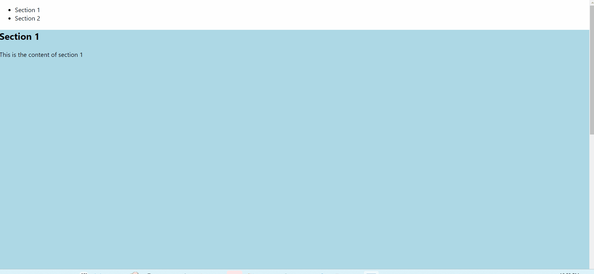

<h1 align='center'> React Scroll</h1>

<p align='center'>React component for animating vertical scrolling

## Table of Contents

- [Introduction](#introduction)
- [Features](#features)
- [Install](#install)
- [Run](#run)
- [Examples](#examples)
- [Example of Using react-scroll with image](#example-of-using-react-scroll-with-image-and-detailed-explanation)
- [Usage](#usage)
- [Props/Options](#Props/Options)
- [Full example](#Full-example)
- [Scroll Methods](#scroll-methods)
- [Scroll Events](#scroll-events)
- [Best Practices and Tips](#best-practices-and-tips)
- [Troubleshooting and FAQs](#troubleshooting-and-faqs)
- [Contribution](#contributions)
- [Changelog](#changelog)

### Introduction
React-Scroll is a lightweight library for enhancing scrolling functionality in React applications. Whether you're building a single-page application, a portfolio site, or a complex web application, React Scroll provides you with an easy-to-use solution for implementing smooth scrolling behavior. This works with the latest versions of Google Chrome, Microsodt Edge, and Firefox. 

### React-Scroll AI Bot

[React-Scroll](https://codeparrot.ai/oracle?owner=fisshy&repo=react-scroll) Bot will help you understand this repository better. You can ask for code examples, installation guide, debugging help and much more.

### Features
- Smooth Scrolling: Achieve seamless scrolling animations between sections of your web page.
- Customization: Customize scroll behavior to suit your application's design and user experience requirements.
- Accessibility: Ensure your scrolling functionality is accessible to all users, including those who rely on assistive technologies.
- Lightweight: Keep your bundle size small with React Scroll's minimal footprint.

### Install

```js
$ npm install react-scroll
```
or

```
$ yarn add react-scroll
```

### Run

```js
$ npm install
$ npm test
$ npm start
```

or

```js
$ yarn
$ yarn test
$ yarn start

```

### Examples

Checkout examples

Live example

> [Basic](https://codesandbox.io/s/basic-6t84k)

> [Basic-Keydown](https://codesandbox.io/s/l94kv62o4m)

> [Container](https://codesandbox.io/s/3zznv27l5)

> [With-hash](https://codesandbox.io/s/y0zzrk1v1j)

> [With-overflow](https://codesandbox.io/s/l94kv62o4m)

> [Code](https://github.com/fisshy/react-scroll/blob/master/examples/basic/app.js)

Code example

> [Next.js](https://github.com/fisshy/react-scroll/blob/master/examples/_next-js/page.tsx)


### Example of Using react-scroll with image and detailed explanation!
In this example, the react-scroll library was utilized to enable smooth scrolling navigation within a single-page React application. The library provides components such as Link and Element that facilitate seamless navigation between different sections of the page. Once you start your react app, you can add this code at the bottom to experience the scroll feature!

Code:
```js
import React from 'react';
import { Link, Element } from 'react-scroll';

function App() {
  return (
    <div>
      <nav>
        <ul>
          <li>
            <Link to="section1" smooth={true} duration={500}>Section 1</Link>
          </li>
          <li>
            <Link to="section2" smooth={true} duration={500}>Section 2</Link>
          </li>
          {/* Add more navigation links as needed */}
        </ul>
      </nav>
      <Element name="section1">
        <section style={{ height: '100vh', backgroundColor: 'lightblue' }}>
          <h1>Section 1</h1>
          <p>This is the content of section 1</p>
        </section>
      </Element>
      <Element name="section2">
        <section style={{ height: '100vh', backgroundColor: 'lightgreen' }}>
          <h1>Section 2</h1>
          <p>This is the content of section 2</p>
        </section>
      </Element>
      {/* Add more sections with Element components as needed */}
    </div>
  );
}

export default App;
```



### Usage

```js
import React, { useEffect } from 'react';
import { Link, Button, Element, Events, animateScroll as scroll, scrollSpy } from 'react-scroll';

const Section = () => {

  // useEffect is used to perform side effects in functional components.
  // Here, it's used to register scroll events and update scrollSpy when the component mounts.
  useEffect(() => {
    
    // Registering the 'begin' event and logging it to the console when triggered.
    Events.scrollEvent.register('begin', (to, element) => {
      console.log('begin', to, element);
    });

    // Registering the 'end' event and logging it to the console when triggered.
    Events.scrollEvent.register('end', (to, element) => {
      console.log('end', to, element);
    });

    // Updating scrollSpy when the component mounts.
    scrollSpy.update();

    // Returning a cleanup function to remove the registered events when the component unmounts.
    return () => {
      Events.scrollEvent.remove('begin');
      Events.scrollEvent.remove('end');
    };
  }, []);

  // Defining functions to perform different types of scrolling.
  const scrollToTop = () => {
    scroll.scrollToTop();
  };

  const scrollToBottom = () => {
    scroll.scrollToBottom();
  };

  const scrollTo = () => {
    scroll.scrollTo(100); // Scrolling to 100px from the top of the page.
  };

  const scrollMore = () => {
    scroll.scrollMore(100); // Scrolling an additional 100px from the current scroll position.
  };

  // Function to handle the activation of a link.
  const handleSetActive = (to) => {
    console.log(to);
  };

  // Rendering the component's JSX.
  return (
  <div>
    {/* Link component to scroll to "test1" element with specified properties */}
    <Link 
      activeClass="active" 
      to="test1" 
      spy={true} 
      smooth={true} 
      offset={50} 
      duration={500} 
      onSetActive={handleSetActive}
    >
      Test 1
    </Link>

    {/* Other Link and Button components for navigation, each with their unique properties and targets */}
    {/* ... */}

    {/* Element components that act as scroll targets */}
    <Element name="test1" className="element">
      test 1
    </Element>
    <Element name="test2" className="element">
      test 2
    </Element>
    <div id="anchor" className="element">
      test 6 (anchor)
    </div>

    {/* Links to elements inside a specific container */}
    <Link to="firstInsideContainer" containerId="containerElement">
      Go to first element inside container
    </Link>
    <Link to="secondInsideContainer" containerId="containerElement">
      Go to second element inside container
    </Link>

    {/* Container with elements inside */}
    <div className="element" id="containerElement">
      <Element name="firstInsideContainer">
        first element inside container
      </Element>
      <Element name="secondInsideContainer">
        second element inside container
      </Element>
    </div>

    {/* Anchors to trigger scroll actions */}
    <a onClick={scrollToTop}>To the top!</a>
    <br/>
    <a onClick={scrollToBottom}>To the bottom!</a>
    <br/>
    <a onClick={scrollTo}>Scroll to 100px from the top</a>
    <br/>
    <a onClick={scrollMore}>Scroll 100px more from the current position!</a>
  </div>
);

};

export default Section;


```

### Props/Options

<table>
<tr>
<td>
activeClass
</td>
<td>
 class applied when element is reached
</td>
</tr>
<tr>
<td>
activeStyle
</td>
<td>
 style applied when element is reached
</td>
</tr>
<tr>
<td>
to
</td>
<td>
 Target to scroll to
</td>
</tr>


<tr>
<td>
containerId
</td>
<td>
 Container to listen for scroll events and to perform scrolling in
</td>
</tr>

<tr>
<td>
spy
</td>
<td>
 Make Link selected when scroll is at its targets position
</td>
</tr>

<tr>
<td>
hashSpy
</td>
<td>
Update hash based on spy, containerId has to be set to scroll a specific element
</td>
</tr>

<tr>
<td>
smooth
</td>
<td>
Animate the scrolling
</td>
</tr>

<tr>
<td>
offset
</td>
<td>
Scroll additional px ( like padding )
</td>
</tr>

<tr>
<td>
duration
</td>
<td>
time of the scroll animation - can be a number or a function (`function (scrollDistanceInPx) { return duration; }`), that allows more granular control at run-time
</td>
</tr>

<tr>
<td>
delay
</td>
<td>
Wait x milliseconds before scroll</td>
</tr>

<tr>
<td>
isDynamic 
</td>
<td>
In case the distance has to be recalculated - if you have content that expands etc.</td>
</tr>

<tr>
<td>
onSetActive
</td>
<td>
Invoke whenever link is being set to active
</td>
</tr>

<tr>
<td>
onSetInactive
</td>
<td>
Invoke whenever link is lose the active status
</td>
</tr>

<tr>
<td>
ignoreCancelEvents
</td>
<td>
 Ignores events which cancel animated scrolling
</td>
</tr>

<tr>
<td>
horizontal 
</td>
<td>
 Whether to scroll vertically (`false`) or horizontally (`true`) - default: `false`
</td>
</tr>

<tr>
<td>
spyThrottle 
</td>
<td>
Time of the spy throttle - can be a number
</td>
</tr>

</table>

### Full example

```js
<Link activeClass="active"
      to="target"
      spy={true}
      smooth={true}
      hashSpy={true}
      offset={50}
      duration={500}
      delay={1000}
      isDynamic={true}
      onSetActive={this.handleSetActive}
      onSetInactive={this.handleSetInactive}
      ignoreCancelEvents={false}
      spyThrottle={500}
>
  Your name
</Link>
```

### Scroll Methods

> Scroll To Top

```js
import { animateScroll } from 'react-scroll';

const options = {
  // your options here, for example:
  duration: 500,
  smooth: true,
};

animateScroll.scrollToTop(options);

```

> Scroll To Bottom

```js
import { animateScroll } from 'react-scroll';

const options = {
  // Your options here, for example:
  duration: 500,
  smooth: true,
};

animateScroll.scrollToBottom(options);

```

> Scroll To (position)

```js
import { animateScroll } from 'react-scroll';

const options = {
  // Your options here, for example:
  duration: 500,
  smooth: true,
};

// Scroll to 100 pixels from the top of the page
animateScroll.scrollTo(100, options);


```

> Scroll To (Element)

animateScroll.scrollTo(positionInPixels, props = {});

```js
import { Element, scroller } from 'react-scroll';

<Element name="myScrollToElement"></Element>

// Somewhere else, even another file
scroller.scrollTo('myScrollToElement', {
  duration: 1500,
  delay: 100,
  smooth: true,
  containerId: 'ContainerElementID',
  offset: 50, // Scrolls to element + 50 pixels down the page
  // ... other options
});

```

> Scroll More (px)

```js
import { animateScroll } from 'react-scroll';

const options = {
  // Your options here, for example:
  duration: 500,
  smooth: true,
};

// Scroll an additional 10 pixels down from the current scroll position
animateScroll.scrollMore(10, options);

```

### Scroll events

> begin - start of the scrolling

```js
import { Events } from 'react-scroll';

Events.scrollEvent.register('begin', function(to, element) {
  console.log('begin', to, element);
});

```

> end - end of the scrolling/animation

```js

import { Events } from 'react-scroll';

Events.scrollEvent.register('end', function(to, element) {
  console.log('end', to, element);
});

```

> Remove events

```js
import { Events } from 'react-scroll';

Events.scrollEvent.remove('begin');
Events.scrollEvent.remove('end');

```

#### Create your own Link/Element
> Simply just pass your component to one of the high order components (Element/Scroll)

```js
import React from 'react';
import { ScrollElement, ScrollLink } from 'react-scroll';

const Element = (props) => {
  return (
    <div {...props} ref={(el) => { props.parentBindings.domNode = el; }}>
      {props.children}
    </div>
  );
};

export const ScrollableElement = ScrollElement(Element);

const Link = (props) => {
  return (
    <a {...props}>
      {props.children}
    </a>
  );
};

export const ScrollableLink = ScrollLink(Link);

```

### Scroll Animations
> Add a custom easing animation to the smooth option. This prop will accept a Boolean if you want the default, or any of the animations listed below

```js
import { scroller } from 'react-scroll';

scroller.scrollTo('myScrollToElement', {
  duration: 1500,
  delay: 100,
  smooth: 'easeInOutQuint',
  containerId: 'ContainerElementID',
  // ... other options
});

```


> List of currently available animations:

```
linear
	- no easing, no acceleration.
easeInQuad
	- accelerating from zero velocity.
easeOutQuad
	- decelerating to zero velocity.
easeInOutQuad
	- acceleration until halfway, then deceleration.
easeInCubic
	- accelerating from zero velocity.
easeOutCubic
	- decelerating to zero velocity.
easeInOutCubic
	- acceleration until halfway, then deceleration.
easeInQuart
	- accelerating from zero velocity.
easeOutQuart
	- decelerating to zero velocity.
easeInOutQuart
	-  acceleration until halfway, then deceleration.
easeInQuint
	- accelerating from zero velocity.
easeOutQuint
	- decelerating to zero velocity.
easeInOutQuint
	- acceleration until halfway, then deceleration.
```

A good visual reference can be found at [easings.net](http://easings.net/)

### Best Practices and Tips
- Optimize performance by limiting the number of elements with scroll events.
- Test your application on various devices and screen sizes to ensure accessibility.

### Troubleshooting and FAQs
- Q: How do I customize the scroll behavior?
- A: You can customize the scroll duration, easing function, and other parameters using the duration, smooth, and offset props.

- Q: Why is my smooth scrolling not working? This can be applied to any prop!
- A: Ensure that the smooth prop is set to true and that your browser supports smooth scrolling.

### Contributions
- To contribute to React-Scroll, please follow these guidelines:

- Fork the repository and create a new branch for your changes.
- Make your changes and submit a pull request with a clear description of your work.
- Include tests and ensure all existing tests pass before submitting your changes.

### Changelog
- [See the CHANGELOG](./CHANGELOG.md)

### License
- React Scroll is licensed under the MIT License. Explore this to understand terms and conditions of the license- https://opensource.org/licenses/MIT


